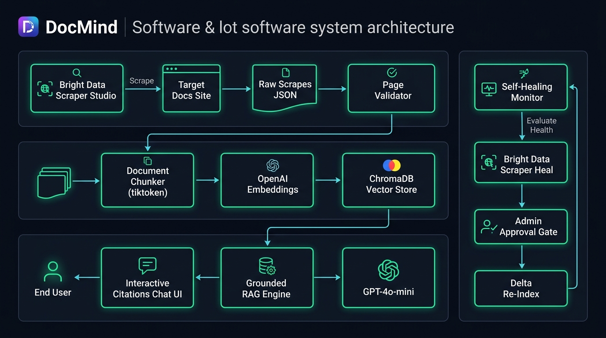
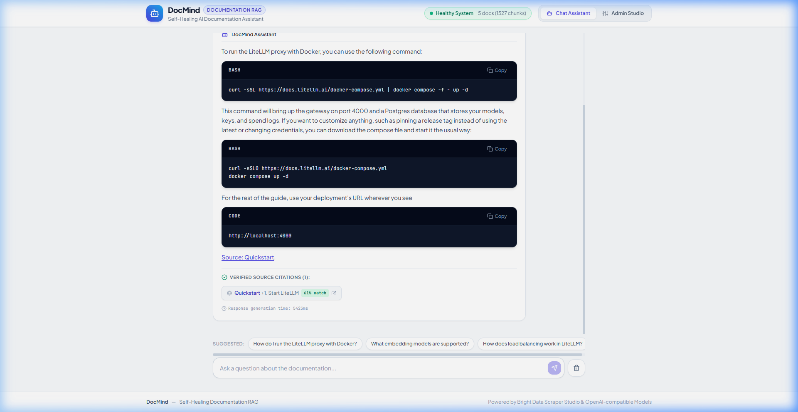
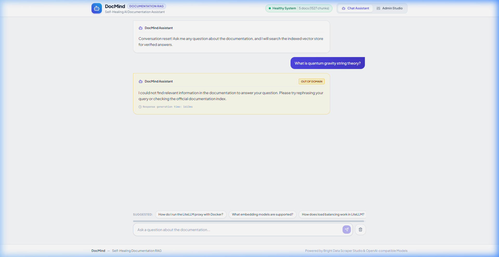
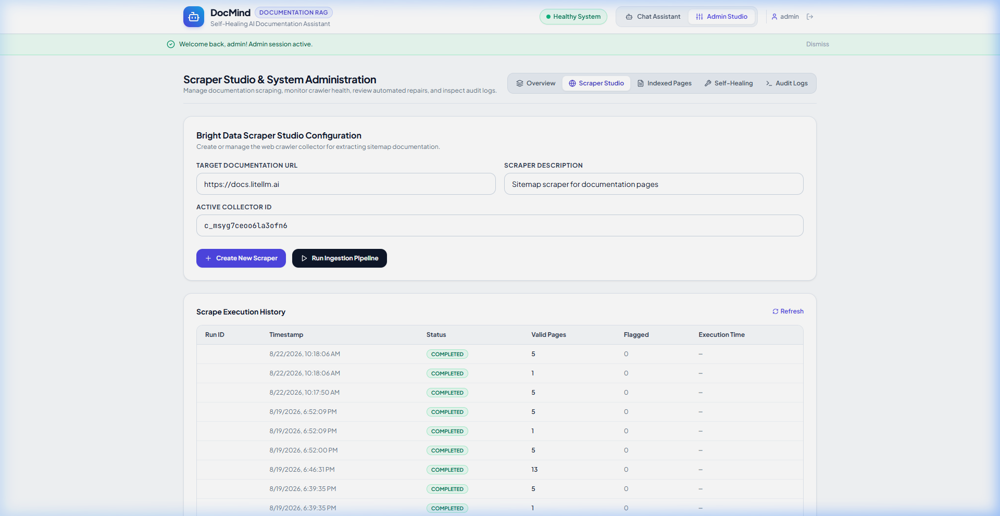
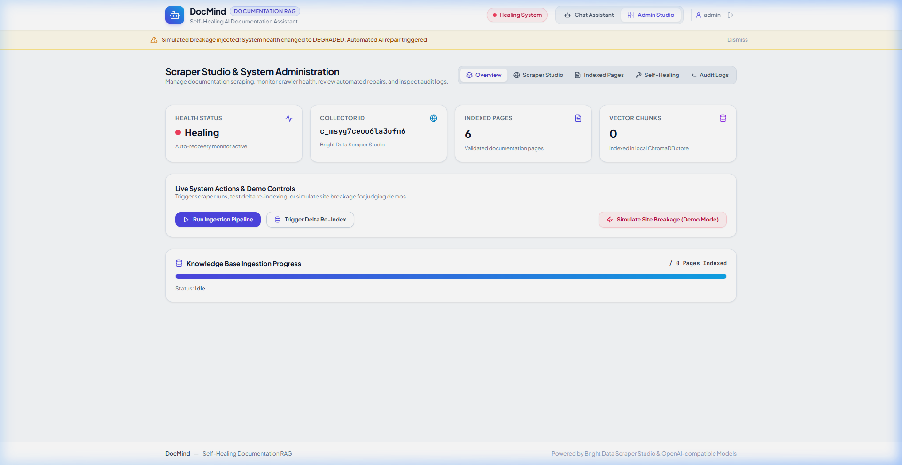

# 🧠 DocMind: Self-Healing Documentation RAG Assistant

[-success)](https://github.com/codedbyasim/DocMind-AI)
[](https://python.org)
[](https://fastapi.tiangolo.com)
[](https://react.dev)
[](https://brightdata.com)
[](LICENSE)

> **Autonomous Documentation Ingestion, Strict Grounding, and Self-Healing Knowledge Base**  
> *Track: Best Use of Bright Data Scraper Studio & Autonomous Self-Healing Scrapers*  
> **Repository:** [https://github.com/codedbyasim/DocMind-AI](https://github.com/codedbyasim/DocMind-AI)

---

## 🌟 Overview

DocMind continuously ingests developer documentation via **Bright Data Scraper Studio (Sitemap Scraper)** and an autonomous **Universal Web Crawler**, indexes documentation into a vector database with strict citation metadata, and powers a real-time grounded chat assistant.

When target documentation websites redesign their DOM structure or update page paths, DocMind's **Health Monitor** autonomously detects page count drops, triggers a **Bright Data Scraper Heal** cycle, and re-indexes the corrected knowledge base without any code changes or manual pipeline intervention.



---

## ✨ Key Features

- **Autonomous Self-Healing Loop**: Automatically flags degraded scrapes, triggers AI scraper repairs, and re-indexes corrected documents.
- **Strict Grounding & Zero Hallucination**: Calibrated confidence threshold (0.50) returns deterministic safety notices for out-of-domain queries.
- **Real-Time Token Streaming**: Server-Sent Events (SSE) stream responses with clickable source links, section badges, and latency metrics.
- **Universal Documentation Crawler**: Built-in fallback crawler handles arbitrary websites via sitemaps and clean HTML extraction.
- **Swappable Architecture**: Interface-driven layers for Embeddings (OpenAI, Cohere, Voyage, Ollama), Vector DBs (Chroma, Pinecone), and LLMs.
- **Role-Based Security**: HMAC-signed administrative session tokens, audit trail logging, and prompt-injection sanitization.

---

## 📸 Screenshots

| Grounded Assistant with Citations | Out-of-Domain Safety Guardrail |
| :---: | :---: |
|  |  |

| Scraper Studio & Ingestion Controls | Self-Healing & Health Monitor |
| :---: | :---: |
|  |  |

*Explore all screenshots with detailed captions in [docs/SCREENSHOTS.md](docs/SCREENSHOTS.md).*

---

## 🚀 Quickstart

### 1. Clone & Configure

```bash
git clone https://github.com/codedbyasim/DocMind-AI.git
cd DocMind
cp .env.example .env
```

### 2. Run with Docker Compose (Recommended)

```bash
docker compose up -d --build
```

Access the application at [http://localhost:8000](http://localhost:8000).

### 3. Run Locally for Development

```bash
# Terminal 1: Backend
python -m venv .venv
source .venv/bin/activate # Windows: .venv\Scripts\activate
pip install -r requirements.txt
uvicorn api.main:app --reload --port 8000

# Terminal 2: Frontend
cd frontend
npm install
npm run dev
```

Open [http://localhost:5173](http://localhost:5173) in your browser.

---

## 📚 Documentation Index

| Guide | Description |
| :--- | :--- |
| 📐 [**docs/ARCHITECTURE.md**](docs/ARCHITECTURE.md) | System architecture, layer breakdown, and data flow |
| ⚙️ [**docs/SETUP.md**](docs/SETUP.md) | Environment setup, `.env` reference table, and local dev |
| 🔌 [**docs/API.md**](docs/API.md) | Full REST API reference with request & response schemas |
| 🐳 [**docs/DEPLOYMENT.md**](docs/DEPLOYMENT.md) | Docker deployment, security hardening, and volumes |
| 🎬 [**docs/DEMO.md**](docs/DEMO.md) | Step-by-step presentation script & judging highlights |
| 🖼️ [**docs/SCREENSHOTS.md**](docs/SCREENSHOTS.md) | Live application screenshots and UI walkthrough |

---

## 🧪 Testing

DocMind includes 53 comprehensive unit and integration tests covering all requirements:

```bash
pytest tests/ -v
# 53 passed in 14.6s (100% pass rate)
```

---

## 📄 License

Distributed under the MIT License. See `LICENSE` for details.
