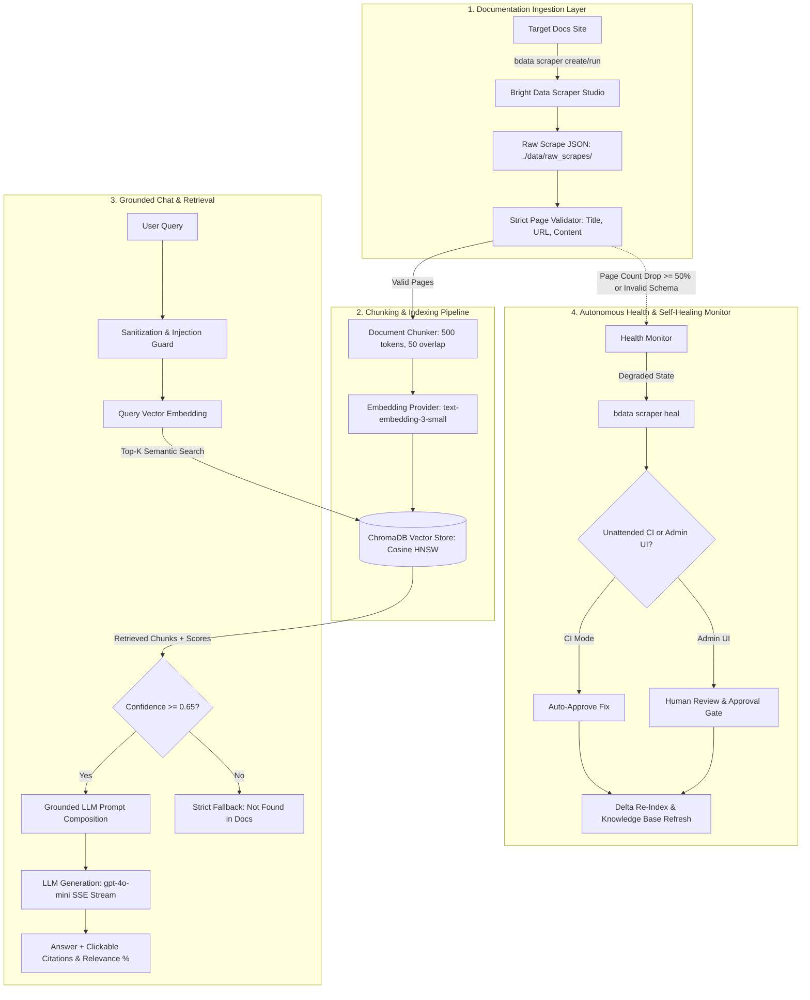

# 🧠 DocMind: Self-Healing Documentation-to-RAG Pipeline

[](https://github.com/codedbyasim/DocMind-AI/actions/workflows/scrape-heal-cycle.yml)
[-success)](https://github.com/codedbyasim/DocMind-AI)
[](https://python.org)
[](https://fastapi.tiangolo.com)
[](https://react.dev)
[](https://brightdata.com)

> **Built for the Bright Data x WeMakeDevs "Scrape-Verse" Hackathon (August 2026)**  
> **Track:** Best Use of Bright Data ("Scrapers in CI, no humans" & "Autonomous Self-Healing Scrapers")  
> **Live GitHub Repository:** [https://github.com/codedbyasim/DocMind-AI](https://github.com/codedbyasim/DocMind-AI)

DocMind continuously ingests developer documentation via **Bright Data Scraper Studio (Sitemap Scraper)**, indexes the content into a vector database with citation metadata, and powers a grounded chat interface. When documentation websites redesign their DOM structure or update styling, DocMind's **Health Monitor** detects the degradation, auto-triggers a **Bright Data Scraper Heal** cycle, and re-indexes the corrected knowledge base without any code changes in downstream layers.

---

## 🏗️ System Architecture & Data Flow



---

## 🚀 Quick Start

You can run DocMind either via **Docker Compose (Recommended)** or locally in development mode.

### Option A: Docker Compose (One Command)

```bash
# 1. Clone the repository
git clone https://github.com/codedbyasim/DocMind-AI.git
cd DocMind-AI

# 2. Set up environment variables
cp .env.example .env
# Edit .env with your Bright Data API token and LLM/Embedding API key

# 3. Launch both backend & frontend with persistent storage
docker compose up -d

# 4. Open in browser:
# - Frontend Web App : http://localhost:3000
# - Backend OpenAPI  : http://localhost:8000/docs
```

---

### Option B: Local Development Setup

#### 1. Backend Setup (Python 3.12+)
```bash
# Create and activate virtual environment
python -m venv venv
source venv/bin/activate  # On Windows: .\venv\Scripts\activate

# Install dependencies
pip install -r requirements.txt

# Start FastAPI server with live reload
uvicorn api.main:app --reload --port 8000
```

#### 2. Frontend Setup (Node.js 18+)
```bash
cd frontend
npm install
npm run dev
# Open http://localhost:5173
```

---

## 🔑 Environment Variable Reference Table

| Variable | Required | Default | Description |
| :--- | :---: | :--- | :--- |
| `BRIGHTDATA_API_KEY` | **Yes** | — | Bright Data API token for CLI scraper creation, execution, and healing. |
| `BRIGHTDATA_COLLECTOR_ID` | Optional | `c_msyg7ceoo6la3ofn6` | Active Bright Data Collector ID for scraping. |
| `TARGET_DOCS_URL` | **Yes** | `https://docs.litellm.ai` | Target documentation website with sitemap. |
| `EMBEDDING_PROVIDER` | No | `openai` | Embedding provider (`openai`, `cohere`, `voyage`, `ollama`, `mock`). |
| `EMBEDDING_API_KEY` | **Yes** | — | API key for embedding generation (AI/ML API or OpenAI). |
| `EMBEDDING_BASE_URL` | Optional | `https://api.aimlapi.com/v1` | OpenAI-compatible endpoint URL. |
| `EMBEDDING_MODEL` | No | `text-embedding-3-small` | Embedding model identifier. |
| `LLM_PROVIDER` | No | `openai` | LLM generation provider (`openai`, `anthropic`, `groq`, `ollama`, `mock`). |
| `LLM_API_KEY` | **Yes** | — | API key for LLM answer generation (AI/ML API or OpenAI). |
| `LLM_BASE_URL` | Optional | `https://api.aimlapi.com/v1` | OpenAI-compatible endpoint URL. |
| `LLM_MODEL` | No | `gpt-4o-mini` | LLM model identifier. |
| `VECTOR_DB_PROVIDER` | No | `chroma` | Vector storage provider (`chroma`, `pinecone`, `mock`). |
| `CHROMA_PERSIST_DIR` | No | `./data/chroma` | Directory for local ChromaDB persistence. |
| `ADMIN_USERNAME` | No | `admin` | Admin dashboard username. |
| `ADMIN_PASSWORD` | No | `docmind_admin_password` | Admin dashboard password. |
| `SESSION_SECRET_KEY` | No | `dev_secret_key_32_bytes_minimum` | HMAC-SHA256 secret for signed session tokens. |
| `DOCMIND_AUTO_APPROVE_HEALS`| No | `false` | Set to `true` in unattended CI/CD automation mode. |

---

## 🎯 How to Point DocMind at a NEW Target Documentation Site

DocMind is completely documentation-agnostic and works with any public documentation website with a discoverable sitemap:

1. **Update `.env`**:
   ```env
   TARGET_DOCS_URL=https://docs.yourframework.io
   ```
2. **Create New Scraper**:
   - In the **Admin Panel Web UI**, enter the new Target URL and click **"Create Scraper (bdata scraper create)"**.
   - Or via CLI:
     ```bash
     npx -y @brightdata/cli scraper create https://docs.yourframework.io "DocMind sitemap scraper" --json
     ```
3. **Run Ingestion & Indexing**:
   - Click **"Run Scraper & Ingest Pages"** in the Admin UI.
   - DocMind automatically scrapes the new site, validates pages, computes embeddings, and indexes chunks into ChromaDB.
4. **Chat**: The Chat interface immediately switches to answering questions against the newly ingested documentation!

---

## 🧪 Running Automated Tests

DocMind features a comprehensive automated test suite with **53 tests** covering all phases, security policies, self-healing cycles, and crash durability:

```bash
# Run all tests
python -m pytest tests/ -v

# Run with test doubles (zero API keys needed)
DOCMIND_MOCK_EMBEDDINGS=true DOCMIND_MOCK_LLM=true python -m pytest tests/ -v
```

---

## 🤖 CI/CD Automation & Autonomous Scrapers (FR-601 to FR-602)

DocMind includes a fully autonomous GitHub Actions workflow ([`.github/workflows/scrape-heal-cycle.yml`](.github/workflows/scrape-heal-cycle.yml)) implementing **"Scrapers in CI, no humans"**:

- **Daily Cron Schedule:** Executes automatically at `04:00 UTC` every day (`0 4 * * *`).
- **Manual Trigger (`workflow_dispatch`):** Run on-demand from the Actions tab with custom target URL overrides.
- **Unattended Self-Healing:** Runs with `DOCMIND_AUTO_APPROVE_HEALS=true`, autonomously repairing scrapers, re-indexing delta updates, and publishing structured markdown reports to GitHub Job Summaries.

### Required GitHub Secrets:
Configure these under **Repository Settings > Secrets and variables > Actions**:
- `BRIGHTDATA_API_KEY`
- `EMBEDDING_API_KEY`
- `LLM_API_KEY`
- `TARGET_DOCS_URL`
- `BRIGHTDATA_COLLECTOR_ID`

---

## 🛡️ Security & Hardening (SRS §5.1, §2.2)

- **Role-Based Authorization:** All administrative endpoints (`/api/admin/*`) are protected by HMAC-SHA256 signed session tokens with idle timeout expiration.
- **Public End-User Chat:** `/api/chat` and `/api/chat/stream` remain public with zero login barriers.
- **Rate Limiting:** Sliding-window rate limiter enforces `CHAT_RATE_LIMIT_PER_MINUTE=20` on chat endpoints.
- **Prompt-Injection Sanitization:** Neutralizes system prompt overrides, delimiters (`<|im_start|>`, `[INST]`, `<<SYS>>`), and shell metacharacters.
- **Structured Audit Logging:** Every scraping run, login, and self-healing action is recorded with actor identity in `./data/logs/audit_log.json`.

---

## ⚖️ Known Limitations & Production Considerations

| Component | Current Implementation | Production Recommendation |
| :--- | :--- | :--- |
| **Chat Latency** | ~6.5s – 10.8s total (via AI/ML API non-streaming proxy); Server-Sent Events token streaming provides immediate first-token response. | Deploy direct Tier-4 low-latency OpenAI endpoints or co-located local models (e.g. Ollama `llama3.2:3b`) for sub-2s total generation. |
| **Admin Session Storage** | Browser `localStorage` with HMAC-SHA256 session token | Upgrade to `httpOnly`, `Secure`, `SameSite=Strict` cookies for high-security enterprise environments. |
| **Vector DB Scaling** | ChromaDB local directory (ideal for 100–10,000 pages) | Set `VECTOR_DB_PROVIDER=pinecone` to scale to millions of chunks across distributed clusters. |

---

## 🛠️ Tech Stack Credits

- **Web Scraping & AI Healing:** [Bright Data Scraper Studio](https://brightdata.com) (`@brightdata/cli`)
- **LLM & Embeddings API:** [AI/ML API](https://aimlapi.com) (`text-embedding-3-small`, `gpt-4o-mini`)
- **Vector Database:** [ChromaDB](https://www.trychroma.com)
- **Backend Framework:** [FastAPI](https://fastapi.tiangolo.com) & [Pydantic v2](https://docs.pydantic.dev)
- **Frontend UI:** [React 18](https://react.dev), [Tailwind CSS](https://tailwindcss.com), [Vite](https://vitejs.dev)
- **Containerization:** [Docker](https://www.docker.com) & [Docker Compose](https://docs.docker.com/compose/)

---

## 📄 License
MIT License. Built for the Bright Data x WeMakeDevs "Scrape-Verse" Hackathon 2026.
