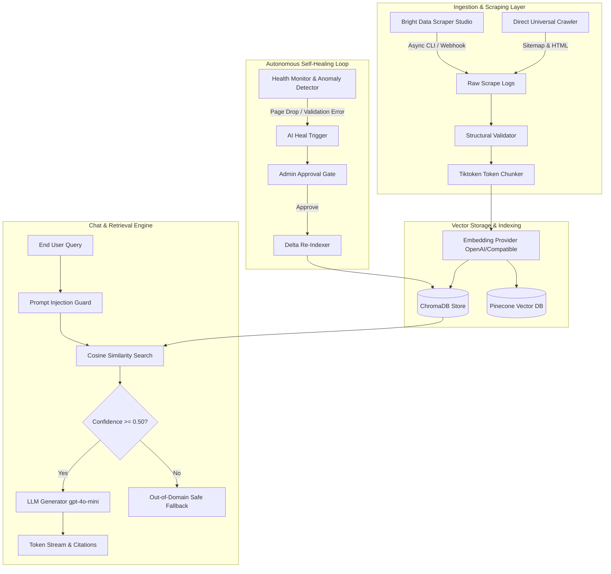

# System Architecture & Layer Breakdown

DocMind is an autonomous, self-healing Documentation RAG (Retrieval-Augmented Generation) assistant. It continuously scrapes, indexes, monitors, and repairs documentation vector embeddings with full provenance tracking.

---

## 1. High-Level Architecture Diagram

---

## 2. Core Architectural Layers

### Layer 1: Ingestion & Web Scraping
- **Primary Scraper**: Bright Data Scraper Studio CLI integration (`@brightdata/cli`) with non-blocking subprocess invocation and `DEVNULL` standard input.
- **Universal Fallback Crawler**: Built-in async `httpx` + `BeautifulSoup` crawler discovering XML sitemaps (`/sitemap.xml`) and extracting structured documentation titles, sections, and code examples.
- **Structural Validator**: Enforces schema rules (non-empty URL, minimum content length, non-empty title) to catch 404 dead pages and corrupted payloads before vectorization.

### Layer 2: Chunking & Embedding Pipeline
- **Chunker**: Model-aligned token-based recursive chunker using `tiktoken` with configurable chunk size (default: 500 tokens) and overlap (default: 50 tokens).
- **Embedding Provider**: Swappable provider interface supporting OpenAI embeddings (`text-embedding-3-small`, 1536 dims) and OpenAI-compatible endpoints with exponential backoff retry.
- **Vector Storage**: Factory-backed swappable vector store supporting local persistent **ChromaDB** and cloud **Pinecone**.

### Layer 3: Grounded Retrieval & Chat Engine
- **Similarity Search**: Cosine distance similarity querying top-$k$ relevant chunks ($k=5$).
- **Strict Grounding & Confidence Calibrator**: Enforces a strict confidence score threshold (default: 0.50). Queries falling below the threshold return a deterministic "Out-of-Domain" safety notice to guarantee zero hallucinations.
- **Real-Time Streaming**: Server-Sent Events (SSE) streaming token-by-token with clickable citation sources, metadata headers, and latency metrics.

### Layer 4: Autonomous Self-Healing Subsystem
- **Anomaly Detection**: Tracks scrape page count trends and flags drops $> 50\%$ or absolute counts $< 5$ pages.
- **AI Refactoring Trigger**: Calls Bright Data AI self-healing API to generate CSS selector repair proposals.
- **Human-in-the-Loop Approval Gate**: Allows administrators to inspect proposed repairs, approve/reject changes, and trigger automated delta re-indexing.

---

## 3. Data Flow

1. **Scrape Trigger**: Admin UI or cron cycle calls `POST /api/admin/scraper/run`.
2. **Raw Logging**: Scraped records are stored atomically in `data/raw_scrapes/{run_id}.json`.
3. **Validation & Indexing**: Valid pages are split into token chunks, embedded via API, and upserted to ChromaDB.
4. **Health Evaluation**: `HealthMonitor.evaluate_system_health()` evaluates run outcome and updates system state (`HEALTHY`, `DEGRADED`, `HEALING`, `ERROR`).
5. **Chat Query**: Users query `POST /api/chat/stream`. Embeddings search ChromaDB; top chunks are injected into grounded system prompts with full citations.
