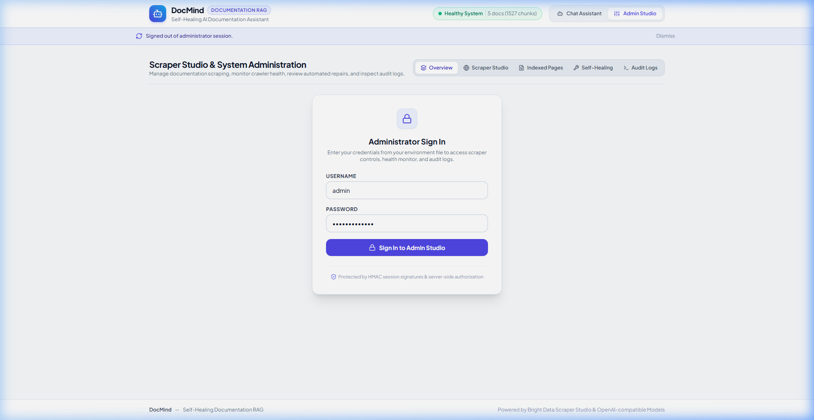
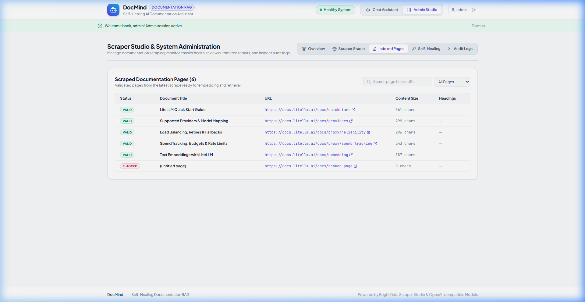
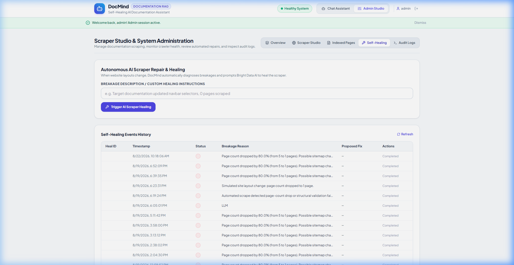

# DocMind Application Screenshots

This gallery showcases real screenshots captured from the live DocMind application.

---

## 1. End User Chat with Grounded Answer & Source Citations
*Real-time token streaming with confidence score and clickable documentation sources.*

---

## 2. Hallucination Defense & Out-of-Domain Fallback
*Enforces strict confidence threshold (0.50) to prevent hallucinations for questions outside the documentation scope.*

---

## 3. Administrative Authentication
*Secure administrative login with HMAC-signed session tokens and rate limiting.*

---

## 4. Scraper Studio & Live Ingestion Controls
*Bright Data Scraper Studio configuration with Universal Direct Crawler fallback.*

---

## 5. Structured Documentation Index
*Table of scraped pages, content lengths, section headings, and validation statuses.*

---

## 6. Health Monitor & Self-Healing Event History
*Autonomous health assessment tracking page count trends and AI repair approvals.*

---

## 7. Autonomous Self-Healing Simulation in Progress
*Real-time state transition from Degraded to Self-Healing after simulated crawler breakage.*

